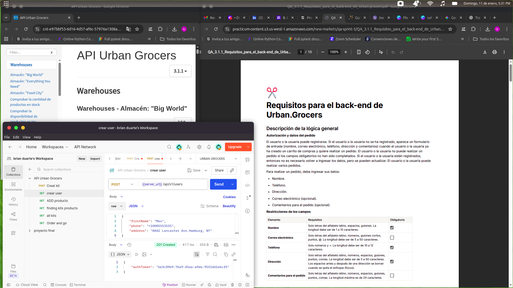

# Qa-Project-4-API-Testing

  

## 📋 Project Description
API testing on Urban.Grocers backend services, validating REST endpoints, HTTP responses, and business rules using Postman.

---

### 📂 Project Resources & Assets
* **📋 Requirements:** [View Functional Requirements (PDF)](https://practicum-content.s3.us-west-1.amazonaws.com/new-markets/qa-sprint-3/QA_3.1.1_Requisitos_para_el_back-end_de_Urban.grocers.pdf)

    
<b><i>Click here to view 🚀 API Documentation</i></b>
 

   **🚀 API Documentation (Endpoints):**
   The project interacts with REST (JSON) and SOAP services. Below is an example of the **warehouse and service validation:**

| Endpoint | Method | Format | Auth | Description |
| :--- | :--- | :--- | :--- | :--- |
| `/big-world/wsdl` | POST | SOAP (XML) | NONE | Stock check for the "Big World" warehouse. |
| `/api/v1/users` | POST | JSON | NONE | User account creation. |
| `/api/v1/kits` | POST | JSON | Bearer Token | Custom kit creation and product grouping validation. |
| `/api/v1/kits/:id/products` | POST | JSON | NONE | **Main.Kits:** Add products to kit. | 
| `/api/v1/kits/:id` | DELETE | JSON | NONE | **Main.Kits:** Delete kit. | 
| `/api/v1/products/kits` | GET | JSON | NONE | **Main.Products:** Search for kit by product. | 
| `/api/v1/kits` | GET | JSON | NONE | **Main.Kits:** Get all kits. Retrieves the complete list of available kits. |
| `/api/v1/kits?cardId={id}` | GET | JSON | NONE | **Main.Kits:** Get kit by Card ID. Filters and retrieves a specific kit. |
| `/order-and-go/v1/delivery` | POST | JSON | NONE | **Couriers:** "Order and Go" delivery validation. |

> **Note:** The full documentation is integrated within the project container. I have included an export of the Postman collection with request examples in the `/docs` folder.

